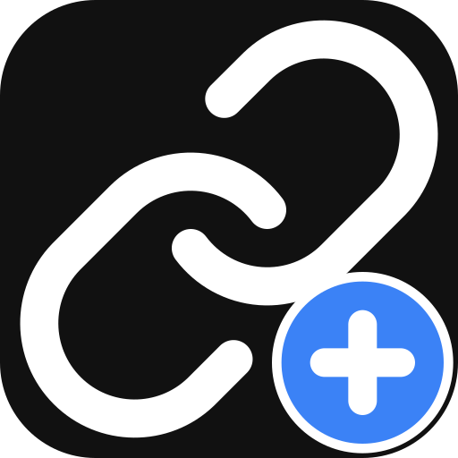
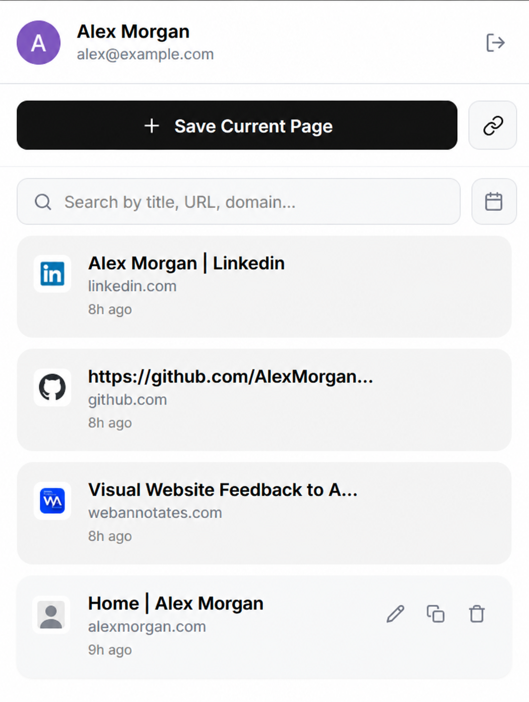
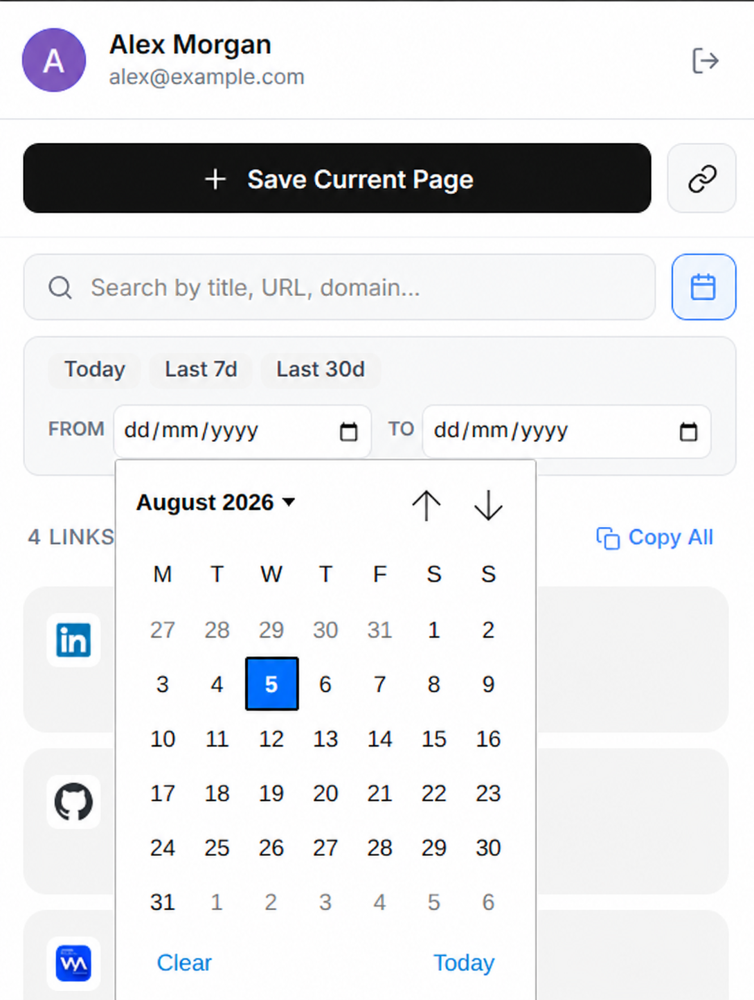

# LinkSave

<p align="center">
  
</p>

<p align="center">A privacy-minded Chrome extension for saving, organizing, and finding links.</p>

LinkSave keeps your useful pages in one personal collection. Sign in with Google, save the current tab or add a URL manually, then search, filter, copy, edit, or remove saved links from the extension popup.

## Preview

<p align="center">
  
  
</p>

The screenshots use generic sample account information.

## Features

- Save the active page from the popup or the browser context menu.
- Add links manually, with an optional custom title.
- Sign in with Google; links are scoped to the signed-in user.
- Search by title, URL, or domain, and filter by a date range.
- Edit titles, delete individual links, or copy the current results to the clipboard.
- Cache links locally so the popup opens quickly while it refreshes in the background.

## Stack

- **Extension:** [WXT](https://wxt.dev/), React, and TypeScript
- **API:** Express and Node.js
- **Data:** MongoDB with Mongoose
- **Authentication:** Chrome Identity API and Google OAuth

## Run locally

### Prerequisites

- Node.js 20 or later
- A MongoDB database (local or hosted)
- A Google OAuth client configured for a Chrome extension

### 1. Install dependencies

```bash
npm ci
cd server && npm ci
cd ..
```

### 2. Configure the API

Create `server/.env` from the example:

```bash
cp server/.env.example server/.env
```

Set the following values:

```dotenv
MONGODB_URI=mongodb://127.0.0.1:27017/linksave
PORT=3001
```

### 3. Configure the extension

Create `.env.local` from the example:

```bash
cp .env.example .env.local
```

For local development, keep the default value:

```dotenv
VITE_API_BASE=http://localhost:3001/api
GOOGLE_OAUTH_CLIENT_ID=your-chrome-extension-client-id.apps.googleusercontent.com
```

For a deployed API, replace `VITE_API_BASE` with that API's public `/api` URL. Before distributing a build, configure `GOOGLE_OAUTH_CLIENT_ID` for your Chrome Web Store extension ID in Google Cloud. An OAuth **client ID** is public by design—it must be present in the built manifest—but sourcing it from `.env.local` keeps deployment configuration out of the repository. Never commit a client secret, database URI, access token, or a real `.env` file.

### 4. Start the app

In one terminal, run the API:

```bash
cd server
npm run dev
```

In another terminal, run the extension:

```bash
npm run dev
```

WXT builds the development extension and prints the location to load in Chrome. Open `chrome://extensions`, enable **Developer mode**, and load the generated extension directory.

## Build a distributable extension

```bash
npm run build
npm run zip
```

The build artifacts are created by WXT in the ignored output directory. Use `npm run build:firefox` or `npm run zip:firefox` for Firefox builds.

## Environment variables

| File | Variable | Purpose |
| --- | --- | --- |
| `.env.local` | `VITE_API_BASE` | Public base URL of the LinkSave API, including `/api`. |
| `.env.local` | `GOOGLE_OAUTH_CLIENT_ID` | Chrome-extension OAuth client ID, inserted into the build manifest. |
| `server/.env` | `MONGODB_URI` | MongoDB connection string. Keep private. |
| `server/.env` | `PORT` | Local API port; defaults to `3001`. |

## Permissions and privacy

LinkSave requests only the permissions needed for its features:

- `identity` for Google sign-in;
- `activeTab` to read the URL and title of the page you choose to save;
- `contextMenus` to add **Save to LinkSave** to the browser menu;
- `notifications` to show save results; and
- `storage` for extension storage support.

The API requires a valid Google access token for every link request and stores links against that user's Google account ID. Review and secure your own deployment before making it available to others.

## API contract

All successful API responses use a `data` envelope; failures use an `error` object with a stable `code`, a readable `message`, and optional field-level `details`.

```json
{ "data": { "link": {} } }
```

```json
{ "error": { "code": "VALIDATION_ERROR", "message": "One or more fields are invalid." } }
```

| Endpoint | Success | Common errors |
| --- | --- | --- |
| `GET /api/health` | `200` | — |
| `GET /api/me` | `200` | `401` unauthenticated |
| `GET /api/links` | `200` | `401`, `503` database unavailable |
| `POST /api/links` | `201` | `400` invalid input, `401`, `409` duplicate link, `503` |
| `PUT /api/links/:id` | `200` | `400` invalid ID/input, `401`, `404`, `503` |
| `DELETE /api/links/:id` | `204` | `400` invalid ID, `401`, `404`, `503` |

The API accepts only `http` and `https` links. A compound database index prevents the same user from saving the same normalized URL more than once, including during concurrent requests.

## Contributing

Contributions are welcome. Please read [CONTRIBUTING.md](CONTRIBUTING.md) for the development workflow, [CODE_OF_CONDUCT.md](CODE_OF_CONDUCT.md) for community expectations, and [SECURITY.md](SECURITY.md) to report vulnerabilities responsibly.

## License

LinkSave is released under the [MIT License](LICENSE).
